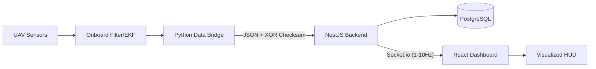

# Глава 4. Програмна реалізація КІУС моніторингу та діагностики БПЛА

## 4.1. Архітектура системи та інформаційні потоки

Програмна реалізація КІУС «SkySentinel» базується на концепції розподілених обчислень та слідує класичному ланцюгу передачі авіаційних даних: «Датчики → Фільтрація (ЕKF) → Радіоканал → Наземна станція (GCS)», як це визначено у Лекції №10.

У розробленій системі роль «Радіоканалу» виконує спеціалізований Python-міст (Data Bridge), який емулює прийом пакетів з борта БПЛА та транслює їх через протокол WebSockets до серверної частини. Бекенд-сегмент (NestJS) виступає в ролі інтелектуального ядра GCS, що здійснює детерміновану діагностику в реальному часі.

### Схема потоків даних (Data Flow)


## 4.2. Алгоритмічне забезпечення модуля «Fault Detector»

Автор впровадив багаторівневу логіку виявлення відмов, що базується на методах аналітичної надмірності та порогового контролю:

1.  **Діагностика ПВД (Airspeed failure):** Реалізовано метод порівняння приладової швидкості (Airspeed) та шляхової швидкості (Ground Speed від GPS). Згідно з Лекцією №10, критичне розходження ($|V_{gps} - V_{ias}| > 15 \text{ км/год}$) сигналізує про відмову трубки Піто або забиття каналу.
2.  **Контроль силової установки:** Алгоритм аналізує кореляцію між положенням дросельної заслінки (Throttle) та вертикальною швидкістю (VSI). Стан «High Throttle (>80%) + Negative VSI (< -1.0 m/s)» ідентифікується як критична втрата тяги або руйнування гвинта.
3.  **GPS Spoofing та геодезичний контроль:** Система перевіряє цілісність координат. У разі отримання нульових значень або різких стрибків, що перевищують фізичні можливості літака, активується режим «GPS Lost», що вимагає переходу на Dead Reckoning навігацію (Лекція №9).

### Таблиця 4.1. Порогові значення діагностичних параметрів
| Параметр | Критична межа | Тип відмови | Дія системи |
| :--- | :--- | :--- | :--- |
| **Vertical Speed** | < -4.5 m/s (alt < 2m) | Hard Landing | Реєстрація інциденту |
| **Airspeed** | < 45 km/h | Stall (Звалювання) | Warning / RTL Command |
| **Pitch / Roll** | > 45° / > 60° | Unusual Attitude | Emergency Alert |
| **Battery** | < 15% | Power Failure | RTL (Return to Launch) |

## 4.3. Інтерфейс користувача та візуалізація в реальному часі

Фронтенд-частина GCS забезпечує візуалізацію телеметрії з частотою оновлення від 1 до 10 Гц, що відповідає стандартам авіаційних систем моніторингу. Основні компоненти інтерфейсу:

*   **Master Caution Panel:** Візуалізація статусів відмов (`Failure`, `Warning`, `Advisory`).
*   **Flight HUD:** Динамічне відображення висоти (Altitude), тангажу (Pitch), крену (Roll) та курсу (Heading).
*   **Telemetry Charts:** Графіки параметрів у часі для виявлення дрейфу датчиків (Sensor Drift).

## 4.4. Збереження даних та Offline-аналіз

Для забезпечення вимог щодо «Offline-аналізу» (Лекція 10, слайд 4), усі вхідні пакети структуруються та зберігаються у реляційній базі даних PostgreSQL. Використання Prisma ORM дозволяє ефективно індексувати дані за часовою міткою (`timestamp`), що забезпечує:
*   Відтворення історії польоту після завершення місії.
*   Генерацію детальних звітів про причини відмов (Post-flight analysis).
*   Порівняння реальних показників з еталонними моделями.

## 4.5. Інформаційна сумісність та валідація даних

Забезпечення низької затримки (low-latency) досягнуто шляхом використання бінарних кадрів через WebSockets. Кожен пакет проходить процедуру валідації цілісності за алгоритмом **XOR (Exclusive OR)**. 

### Струкутра пакету телеметрії
```json
{
  "data": {
    "latitude": 50.4501,
    "longitude": 30.5234,
    "altitude": 105.5,
    "airspeed": 62.0,
    "pitch": 2.5,
    "roll": -1.2,
    "checksum": "A4"
  }
}
```
Така структура гарантує, що пошкоджені під час передачі радіоканалом дані не будуть прийняті модулем діагностики, запобігаючи помилковим спрацюванням (False Positives).
